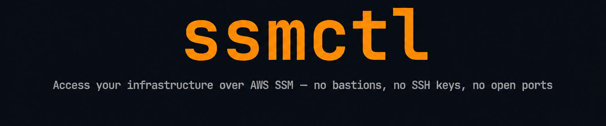

<div align="center">



<h1><strong>Welcome to ssmctl</strong></h1>

<p>Shell access, file transfers and port forwarding over AWS SSM —<br>
no bastion, no open ports, no SSH keys.</p>

<br>

[](https://securityscorecards.dev/viewer/?uri=github.com/rhysmcneill/ssmctl)
[](https://github.com/rhysmcneill/ssmctl/actions/workflows/ci.yml)
[](https://codecov.io/gh/rhysmcneill/ssmctl)
[](https://golang.org)
[](https://github.com/rhysmcneill/ssmctl/releases)
[](LICENSE)
[](https://github.com/rhysmcneill/ssmctl)
[](https://github.com/rhysmcneill/ssmctl/forks)

<br>


</div>

---

## The problem

Getting a shell on an EC2 instance or forwarding a port to a private database looks like this today:

```bash
# Connect to an instance
aws ssm start-session --target i-0abc1234def5678ab

# Forward a port to a private RDS database
aws ssm start-session \
  --target i-0abc1234def5678ab \
  --document-name AWS-StartPortForwardingSessionToRemoteHost \
  --parameters '{"host":["rds.internal"],"portNumber":["5432"],"localPortNumber":["5432"]}'
```

With `ssmctl`:

```bash
# Connect to an instance
ssmctl connect web-1

# Forward a port to a private RDS database
ssmctl forward web-1 --local 5432 --remote rds.internal:5432
```

Same AWS APIs, same security model but dramatically better user experience.

---

## Install

```bash
# Homebrew (macOS / Linux)
brew tap rhysmcneill/ssmctl
brew install ssmctl

# Or grab a binary directly
curl -L https://github.com/rhysmcneill/ssmctl/releases/latest/download/ssmctl-linux-amd64 \
  -o /usr/local/bin/ssmctl && chmod +x /usr/local/bin/ssmctl
```

> Binaries for Linux, macOS, and Windows on every [release](https://github.com/rhysmcneill/ssmctl/releases). See the [installation guide](docs/installation.md) for the Session Manager plugin setup and shell completion instructions.

**Shell completion** — Homebrew users get tab completion automatically. For binary installs, run once:

```bash
# Bash
echo 'source <(ssmctl completion bash)' >> ~/.bashrc

# Zsh
echo 'source <(ssmctl completion zsh)' >> ~/.zshrc

# Fish
ssmctl completion fish > ~/.config/fish/completions/ssmctl.fish
```

---

## Real-world use cases

### Debug a production instance without a bastion

```bash
# Find the instance by Name tag
ssmctl list --filter api

# Drop straight into a shell
ssmctl connect api-server-1
```

No security group changes, no SSH key creation and rotation, and finally no bastion to maintain.

### Connect your local tools to a private RDS database

```bash
ssmctl forward web-1 --local 5432 --remote prod-db.cluster-xyz.eu-west-1.rds.amazonaws.com:5432
```

Then in another terminal, use any Postgres client as if the database were local:

```bash
psql -h localhost -p 5432 -U admin mydb
```

Works equally well for MySQL, Redis, Elasticsearch, Kafka — anything TCP.

### Run a one-off command across an instance without opening a session

```bash
ssmctl run web-1 -- systemctl status nginx
ssmctl run web-1 -- tail -n 100 /var/log/app.log
ssmctl run web-1 -- df -h /
```

Stdout and stderr stream back to your terminal - Exit codes are propagated.

### Pull a log file off an instance with one command

```bash
ssmctl cp web-1:/var/log/app.log ./app.log
```

No SCP or bastion jump host needed. For files over ~36 KB, use the S3-backed path:

```bash
ssmctl cp --via s3://my-bucket/staging web-1:/var/log/access.log.2 ./access.log.2
```

---

## Why not just use the AWS CLI?

<div align="center">

| Task | AWS CLI | ssmctl |
|------|---------|--------|
| Interactive shell | `aws ssm start-session --target i-0abc...` | `ssmctl connect web-1` |
| Run a command | `aws ssm send-command --instance-ids ... --document-name AWS-RunShellScript --parameters commands=["uptime"]` | `ssmctl run web-1 -- uptime` |
| Port forward to RDS | 4-line JSON blob | `ssmctl forward web-1 --local 5432 --remote db:5432` |
| Resolve by Name tag | Manual `ec2 describe-instances` first | Built-in |
| Structured output | Manual `--query` / `jq` | `--output json` |

</div>

`ssmctl` wraps the same APIs — it is not a different security model, just a dramatically better interface.

---

## Commands

| Command | Description |
|---------|-------------|
| `ssmctl list` | Discover all SSM-managed instances in your account |
| `ssmctl connect <target>` | Interactive shell session |
| `ssmctl forward <target> --local N --remote host:N` | Port forward to any TCP endpoint |
| `ssmctl run <target> -- <cmd>` | Run a one-shot command and stream output |
| `ssmctl cp ./file <target>:/path` | Upload a file |
| `ssmctl cp <target>:/path ./file` | Download a file |
| `ssmctl cp --via s3://bucket <src> <dst>` | Large file transfer via S3 staging |
| `ssmctl completion [bash\|zsh\|fish\|powershell]` | Generate shell completion scripts |

A `<target>` is an instance ID (`i-0abc...`) or a Name tag (`web-1`). See the [full command reference](docs/commands.md).

---

## Authentication

`ssmctl` delegates all authentication to the [AWS SDK for Go v2](https://aws.github.io/aws-sdk-go-v2/docs/configuring-sdk/). Credentials and region are resolved in the following order of precedence — the first match wins.

### Credentials

| Priority | Source | Details |
|----------|--------|---------|
| 1 | `--profile` flag | Loads the named profile from `~/.aws/config` and `~/.aws/credentials` |
| 2 | `AWS_PROFILE` env var | Same as `--profile` but set in the environment |
| 3 | `AWS_ACCESS_KEY_ID` / `AWS_SECRET_ACCESS_KEY` | Static key pair, optionally with `AWS_SESSION_TOKEN` for temporary credentials |
| 4 | `~/.aws/credentials` + `~/.aws/config` | Default profile, or `[profile name]` blocks including SSO / IAM Identity Center profiles |
| 5 | Container credentials | ECS task role via `AWS_CONTAINER_CREDENTIALS_RELATIVE_URI` |
| 6 | EC2 instance metadata (IMDS) | IAM role attached to the instance — works automatically when running on EC2 |

### Region

| Priority | Source |
|----------|--------|
| 1 | `--region` flag (or `-r`) |
| 2 | `AWS_REGION` environment variable |
| 3 | `AWS_DEFAULT_REGION` environment variable |
| 4 | `region` in the active `~/.aws/config` profile |

### Common patterns

```bash
# Use a named profile
ssmctl --profile prod connect web-1

# Override region for a single command
ssmctl --region us-east-1 list

# Use a profile that signs in via IAM Identity Center (SSO)
aws sso login --profile staging
ssmctl --profile staging connect api-1

# Credentials from the environment (e.g. in CI)
export AWS_ACCESS_KEY_ID=...
export AWS_SECRET_ACCESS_KEY=...
export AWS_REGION=eu-west-1
ssmctl list
```

> [!IMPORTANT]
> `ssmctl` does not store or manage credentials itself — it reads whatever the AWS SDK resolves. If a command fails with an authentication error, run `aws sts get-caller-identity --profile <name>` to verify your credentials are valid before filing a bug.

---

## Documentation

| | |
|--|--|
| [Command reference](docs/commands.md) | All commands, flags, and examples |
| [Installation guide](docs/installation.md) | Setup and prerequisites |
| [Verification guide](docs/verification.md) | SLSA Attestation verification steps |
| [IAM reference](docs/iam.md) | Exact permissions per command with copy-paste policies |
| [Contributing](CONTRIBUTING.md) | How to build, test, and submit changes |

---

## Contributors

Thank you to everyone who has contributed to ssmctl!

The team really value your submissions — you are helping shape the future of ssmctl.

[](https://github.com/rhysmcneill/ssmctl/graphs/contributors)

Contributions are welcome — see [CONTRIBUTING.md](CONTRIBUTING.md) to get started.

---

<div align="center">
MIT License &nbsp;·&nbsp; <a href="https://github.com/rhysmcneill/ssmctl/issues">Report a bug</a> &nbsp;·&nbsp; <a href="https://github.com/rhysmcneill/ssmctl/issues">Request a feature</a>
</div>
